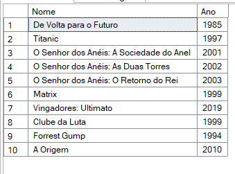
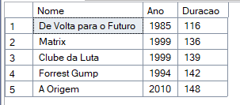
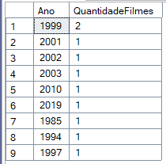
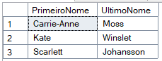
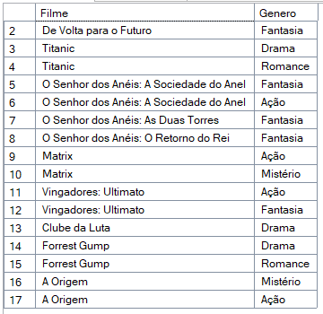
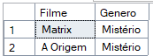
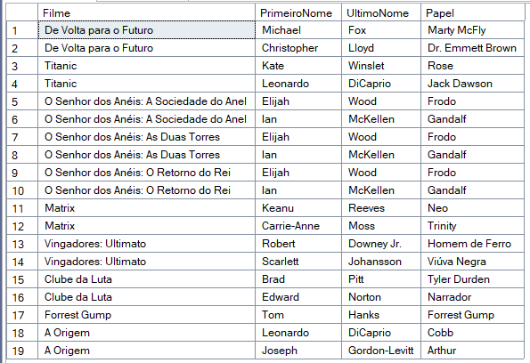

# Trilha .NET - Banco de Dados - DIO

## 📌 Sobre o Projeto

Este projeto foi desenvolvido como parte de um desafio prático da **DIO (Digital Innovation One)**.

## ⚙️ Diagrama

## 1 - Buscar o nome e ano dos filmes

  

## 2 - Buscar o nome e ano dos filmes, ordenados por ordem crescente pelo ano

  

## 3 - Buscar pelo filme de volta para o futuro, trazendo o nome, ano e a duração

  

## 4 - Buscar os filmes lançados em 1997

  

## 5 - Buscar os filmes lançados APÓS o ano 2000

  

## 6 - Buscar os filmes com a duracao maior que 100 e menor que 150, ordenando pela duracao em ordem crescente

  

## 7 - Buscar a quantidade de filmes lançadas no ano, agrupando por ano, ordenando pela duracao em ordem decrescente

  

## 8 - Buscar os Atores do gênero masculino, retornando o PrimeiroNome, UltimoNome

  

## 9 - Buscar os Atores do gênero feminino, retornando o PrimeiroNome, UltimoNome, e ordenando pelo PrimeiroNome

  

## 10 - Buscar o nome do filme e o gênero

  

## 11 - Buscar o nome do filme e o gênero do tipo "Mistério"

  

## 12 - Buscar o nome do filme e os atores, trazendo o PrimeiroNome, UltimoNome e seu Papel

  

## 👩‍💻 Autora

**Stephanie Tavares dos Santos**  
🔗 [LinkedIn](https://www.linkedin.com/in/stephanie-t-santos/)  
💻 [GitHub](https://github.com/stephtavzz)  

Este projeto foi desenvolvido para fins educacionais, como parte de um desafio da plataforma DIO, visando a prática da Trilha em Banco de Dados SQL Server.
